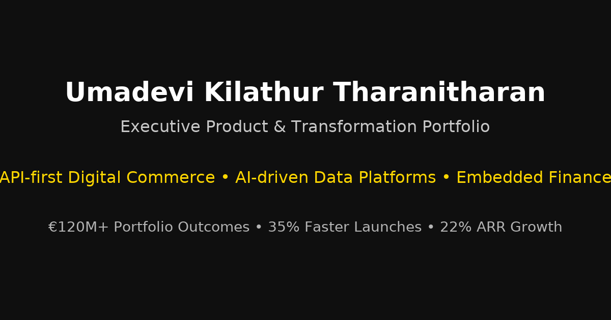

# 🌐 Umadevi Kilathur Tharanitharan — Executive Product & Transformation Portfolio

**Strategic Product & Transformation Leader**  
Specializing in API-first digital commerce, AI-powered data platforms, embedded finance, and global SaaS scaling.

I help enterprises modernize legacy systems, embed finance into customer journeys, and leverage AI-driven platforms to deliver measurable business outcomes — from **35% faster launches** to **€120M+ portfolio impact** and **22%+ ARR growth**.

---

## 📌 Executive Summary
- **20+ years** in fintech, SaaS, and enterprise digital transformation
- Led **€120M+** in portfolio outcomes across multi-market platform initiatives
- Delivered **35% faster time-to-market** through API-first architectures
- Scaled ARR by **22%+** via embedded finance and data-driven engagement
- Expert in **PSD2, ISO 20022, GDPR compliance** for global platforms

---

## 🚀 Signature Portfolio

| Project | Focus Area | Key Impact |
| ------- | ---------- | ---------- |
| [API-First Digital Commerce Platform](api-first-commerce-platform/README.md) | Commerce & Payments Innovation | €25M ARR uplift, +20% checkout conversion |
| [AI-Driven Data Platform Strategy](ai-data-platform-strategy/README.md) | Data & AI Transformation | 50% error reduction, real-time insights |
| [Embedded Finance in eCommerce](embedded-finance-ecommerce/README.md) | Fintech Integration | +20% conversion, BNPL rollout in 12 markets |
| [Platform Intelligence & Personalization](platform-intelligence/README.md) | Customer Experience | +20% engagement, +15% retention |

---

## 📊 Areas of Expertise
- **Digital Commerce Leadership** — Multi-market, multi-rail commerce platforms
- **Embedded Finance** — Payments, BNPL, invoice factoring
- **AI & Data Platforms** — Predictive analytics, personalization, compliance automation
- **Enterprise SaaS Scaling** — API-first, cloud-native, microservices architectures
- **Regulatory Compliance** — PSD2, ISO 20022, GDPR

---

## 🛠 Technology Highlights

---

## 📬 Connect With Me
- **LinkedIn**: [linkedin.com/in/umadevikilathur](https://linkedin.com/in/umadevikilathur)
- **Portfolio**: *(this repository)*

---

> This portfolio is designed to showcase high-impact strategic projects. Each case study includes **Challenge → Actions → Impact** with quantifiable business results.
